# 📐 Ledger Agent — Full Agentic Architecture

> A comprehensive technical reference for professors, senior engineers, and researchers who want to understand, replicate, or extend the Ledger multi-agent data analysis system.

---

## Table of Contents

1. [System Philosophy](#1-system-philosophy)
2. [High-Level Pipeline Overview](#2-high-level-pipeline-overview)
3. [The Central Ledger — Data Model](#3-the-central-ledger--data-model)
4. [Agent Deep-Dives](#4-agent-deep-dives)
   - [A0 — Data Janitor](#a0--data-janitor)
   - [A1 — Profiler](#a1--profiler-fully-deterministic)
   - [A2 — Proposer + RAG](#a2--proposer-llm--rag)
   - [A3 — Registrar (The Freeze)](#a3--registrar-the-freeze)
   - [A4 — Executor (ReAct Loop)](#a4--executor-react-loop)
   - [A5 — Statistician](#a5--statistician-fully-deterministic)
   - [A6 — Reporter](#a6--reporter-grounded-llm)
   - [A7 — Adversary (Red Team)](#a7--adversary-red-team)
   - [A8 — Meta-Agent (Self-Improving)](#a8--meta-agent-self-improving-loop)
   - [A9 — SQL Converter + Flowchart](#a9--nl--sql--mermaid-flowchart)
   - [A10 — Visual Analyst](#a10--visual-analyst)
5. [Tool Calling & Function Chains](#5-tool-calling--function-chains)
6. [RAG Architecture](#6-rag-architecture)
7. [Multi-Agent Orchestration](#7-multi-agent-orchestration)
8. [Self-Improving Loop (A8)](#8-self-improving-loop-detailed)
9. [Observability & Telemetry Pipeline](#9-observability--telemetry-pipeline)
10. [Security & Sandbox](#10-security--sandbox)
11. [Evaluation Framework](#11-evaluation-framework)
12. [Token Optimization Strategy](#12-token-optimization-strategy)
13. [Deployment Architecture](#13-deployment-architecture)

---

## 1. System Philosophy

### The Core Invariant

Ledger is built around one structural guarantee that separates it from all existing LLM data tools:

> **The LLM (A2) proposes hypotheses. The deterministic layer (A5) decides outcomes. The LLM cannot see statistical results before hypotheses are permanently registered.**

This is not a prompt engineering trick. It is enforced at the **data model level**:

```python
# From core/ledger.py
def add_hypothesis(self, entry: HypothesisEntry) -> None:
    if self.is_frozen:
        raise ValueError(
            "Ledger is frozen. No hypotheses can be added after A3 (Registrar) completes."
        )
    self.hypotheses.append(entry)
```

After `A3.run()` calls `ledger.freeze()`, this method raises a `ValueError`. The ordering is enforced in code, not convention.

### Why This Matters

Standard LLM data tools suffer from the **multiple comparisons problem**:
1. LLM sees the data
2. LLM runs many exploratory tests
3. LLM reports only the significant ones
4. Result: inflated false positive rates, irreproducible findings

Ledger's approach:
1. LLM sees **only the schema** (column names, types, distributions) — never raw values
2. LLM proposes hypotheses **before any test runs**
3. Registry is **frozen** (immutable hash computed)
4. ALL hypotheses are tested, ALL results reported (including null results)
5. Benjamini-Hochberg FDR correction applied **across the entire session**

---

## 2. High-Level Pipeline Overview

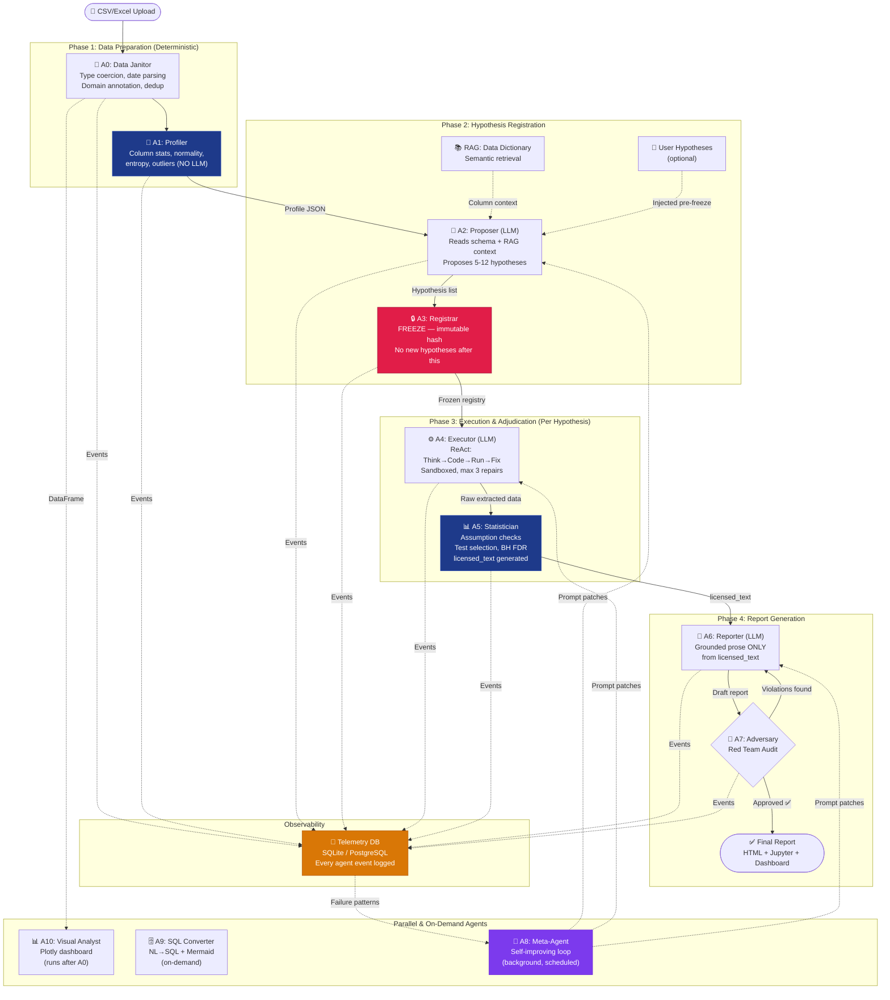
```mermaid
flowchart TD
    Upload([📁 CSV/Excel Upload]) --> A0

    subgraph "Phase 1: Data Preparation (Deterministic)"
        A0["🧹 A0: Data Janitor\nType coercion, date parsing\nDomain annotation, dedup"]
        A1["🔬 A1: Profiler\nColumn stats, normality,\nentropy, outliers (NO LLM)"]
        A0 --> A1
    end

    subgraph "Phase 2: Hypothesis Registration"
        A2["🤔 A2: Proposer (LLM)\nReads schema + RAG context\nProposes 5-12 hypotheses"]
        A3["🔒 A3: Registrar\nFREEZE — immutable hash\nNo new hypotheses after this"]
        A1 -->|Profile JSON| A2
        RAG["📚 RAG: Data Dictionary\nSemantic retrieval"] -.->|Column context| A2
        UserH["👤 User Hypotheses\n(optional)"] -.->|Injected pre-freeze| A2
        A2 -->|Hypothesis list| A3
    end

    subgraph "Phase 3: Execution & Adjudication (Per Hypothesis)"
        A4["⚙️ A4: Executor (LLM)\nReAct: Think→Code→Run→Fix\nSandboxed, max 3 repairs"]
        A5["📊 A5: Statistician\nAssumption checks\nTest selection, BH FDR\nlicensed_text generated"]
        A3 -->|Frozen registry| A4
        A4 -->|Raw extracted data| A5
    end

    subgraph "Phase 4: Report Generation"
        A6["📝 A6: Reporter (LLM)\nGrounded prose ONLY\nfrom licensed_text"]
        A7{"🔴 A7: Adversary\nRed Team Audit"}
        A5 -->|licensed_text| A6
        A6 -->|Draft report| A7
        A7 -->|Violations found| A6
        A7 -->|Approved ✅| OUT
    end

    subgraph "Parallel & On-Demand Agents"
        A10["📊 A10: Visual Analyst\nPlotly dashboard\n(runs after A0)"]
        A9["🗄️ A9: SQL Converter\nNL→SQL + Mermaid\n(on-demand)"]
        A8["🧠 A8: Meta-Agent\nSelf-improving loop\n(background, scheduled)"]
        A0 -.->|DataFrame| A10
    end

    subgraph "Observability"
        OBS["📡 Telemetry DB\nSQLite / PostgreSQL\nEvery agent event logged"]
    end

    A0 & A1 & A2 & A3 & A4 & A5 & A6 & A7 -.->|Events| OBS
    OBS -.->|Failure patterns| A8
    A8 -.->|Prompt patches| A2 & A4 & A6

    OUT([✅ Final Report\nHTML + Jupyter + Dashboard])

    style A3 fill:#E11D48,color:#fff,stroke:#9F1239
    style A5 fill:#1E3A8A,color:#fff,stroke:#1e40af
    style A1 fill:#1E3A8A,color:#fff,stroke:#1e40af
    style A8 fill:#7C3AED,color:#fff,stroke:#6d28d9
    style OBS fill:#D97706,color:#fff,stroke:#b45309
```

---

## 3. The Central Ledger — Data Model

Every agent reads from and writes to a single **`Ledger`** Pydantic object. No agent communicates with another via plain text or side channels. This is the architectural guarantee against hallucination.

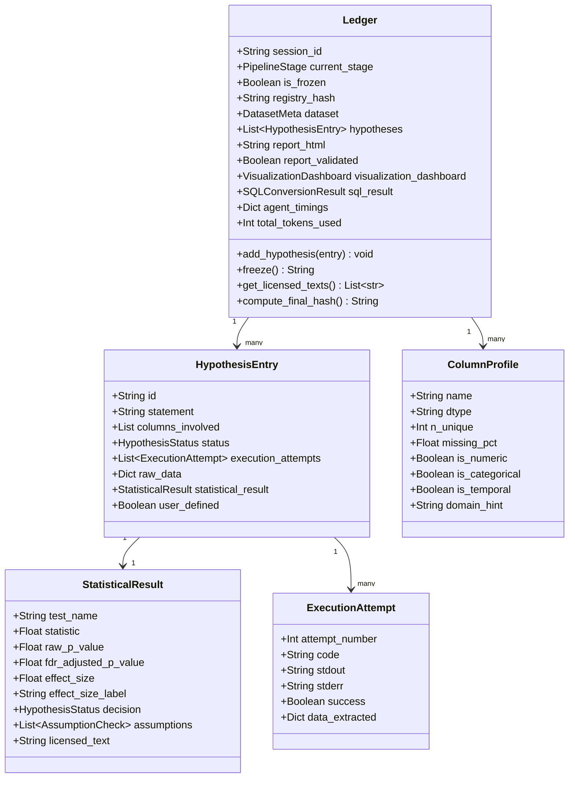
```mermaid
classDiagram
    class Ledger {
        +String session_id
        +PipelineStage current_stage
        +Boolean is_frozen
        +String registry_hash
        +DatasetMeta dataset
        +List~HypothesisEntry~ hypotheses
        +String report_html
        +Boolean report_validated
        +VisualizationDashboard visualization_dashboard
        +SQLConversionResult sql_result
        +Dict agent_timings
        +Int total_tokens_used
        +add_hypothesis(entry) void
        +freeze() String
        +get_licensed_texts() List~str~
        +compute_final_hash() String
    }

    class HypothesisEntry {
        +String id
        +String statement
        +List columns_involved
        +HypothesisStatus status
        +List~ExecutionAttempt~ execution_attempts
        +Dict raw_data
        +StatisticalResult statistical_result
        +Boolean user_defined
    }

    class StatisticalResult {
        +String test_name
        +Float statistic
        +Float raw_p_value
        +Float fdr_adjusted_p_value
        +Float effect_size
        +String effect_size_label
        +HypothesisStatus decision
        +List~AssumptionCheck~ assumptions
        +String licensed_text
    }

    class ExecutionAttempt {
        +Int attempt_number
        +String code
        +String stdout
        +String stderr
        +Boolean success
        +Dict data_extracted
    }

    class ColumnProfile {
        +String name
        +String dtype
        +Int n_unique
        +Float missing_pct
        +Boolean is_numeric
        +Boolean is_categorical
        +Boolean is_temporal
        +String domain_hint
    }

    Ledger "1" --> "many" HypothesisEntry
    HypothesisEntry "1" --> "1" StatisticalResult
    HypothesisEntry "1" --> "many" ExecutionAttempt
    Ledger "1" --> "many" ColumnProfile
```

### The `licensed_text` Contract

This is the most important field in the entire system:

```python
# From core/ledger.py
def get_licensed_texts(self) -> List[str]:
    """Returns the ONLY texts the Reporter (A6) is allowed to use."""
    return [
        h.statistical_result.licensed_text
        for h in self.hypotheses
        if h.statistical_result and h.statistical_result.licensed_text
    ]
```

`licensed_text` is generated **deterministically** by A5 (no LLM). Example:

```
"Mean monthly_charges differs between churned and retained customers — 
Welch's t-test confirmed a statistically significant association 
(p=0.0023, FDR-corrected; effect size: large [0.821])."
```

A6 can ONLY use these sentences. A7 checks that A6 obeyed.

---

## 4. Agent Deep-Dives

### A0 — Data Janitor

**Nature:** Hybrid (Deterministic Pandas + rule-based domain detection)  
**File:** [`backend/agents/a0_janitor.py`](./backend/agents/a0_janitor.py)

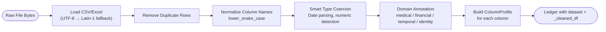
```mermaid
flowchart LR
    IN([Raw File Bytes]) --> Load
    Load["Load CSV/Excel\n(UTF-8 → Latin-1 fallback)"]
    Load --> Dedup["Remove Duplicate Rows"]
    Dedup --> Normalize["Normalize Column Names\nlower_snake_case"]
    Normalize --> Coerce["Smart Type Coercion\nDate parsing, numeric detection"]
    Coerce --> Domain["Domain Annotation\nmedical / financial / temporal / identity"]
    Domain --> Profile["Build ColumnProfile\nfor each column"]
    Profile --> OUT([Ledger with dataset + _cleaned_df])
```

**Domain Detection Rules:**

| Domain | Keywords Matched |
|--------|-----------------|
| `medical` | `bp_`, `systolic`, `glucose`, `bmi`, `diagnosis` |
| `financial` | `revenue`, `salary`, `price`, `credit`, `loan` |
| `temporal` | `date`, `time`, `timestamp`, `created_at` |
| `identity` | `id`, `uuid`, `user_id`, `customer_id` |
| `geographic` | `city`, `state`, `latitude`, `longitude` |

---

### A1 — Profiler (Fully Deterministic)

**Nature:** 100% deterministic. No LLM. No randomness.  
**File:** [`backend/agents/a1_profiler.py`](./backend/agents/a1_profiler.py)

The profiler computes deep statistical summaries. The LLM (A2) reads this JSON — it never sees raw data. This prevents the LLM from "peeking" and gaming hypothesis proposals.

**Per-column statistics computed:**

| Column Type | Statistics |
|------------|------------|
| **Numeric** | count, mean, std, min, Q25, median, Q75, max, IQR, skewness, kurtosis, Shapiro-Wilk normality p-value, outlier count |
| **Categorical** | n_unique, top-5 value counts, mode, Shannon entropy, is_binary |
| **Temporal** | min_date, max_date, date range in days |
| **All** | n_missing, missing_pct, n_unique, is_id_like (>95% unique) |

**Output (passed to A2):**

```json
{
  "shape": {"rows": 7043, "cols": 21},
  "columns": {
    "monthly_charges": {
      "type": "numeric",
      "mean": 64.76, "std": 30.09,
      "is_normal_shapiro": false,
      "shapiro_p": 0.0001,
      "outlier_count": 12
    },
    "churn": {
      "type": "categorical",
      "is_binary": true,
      "top_5": {"No": 5174, "Yes": 1869}
    }
  }
}
```

---

### A2 — Proposer (LLM + RAG)

**Nature:** LLM (Groq `llama-3.3-70b-versatile`)  
**File:** [`backend/agents/a2_proposer.py`](./backend/agents/a2_proposer.py)

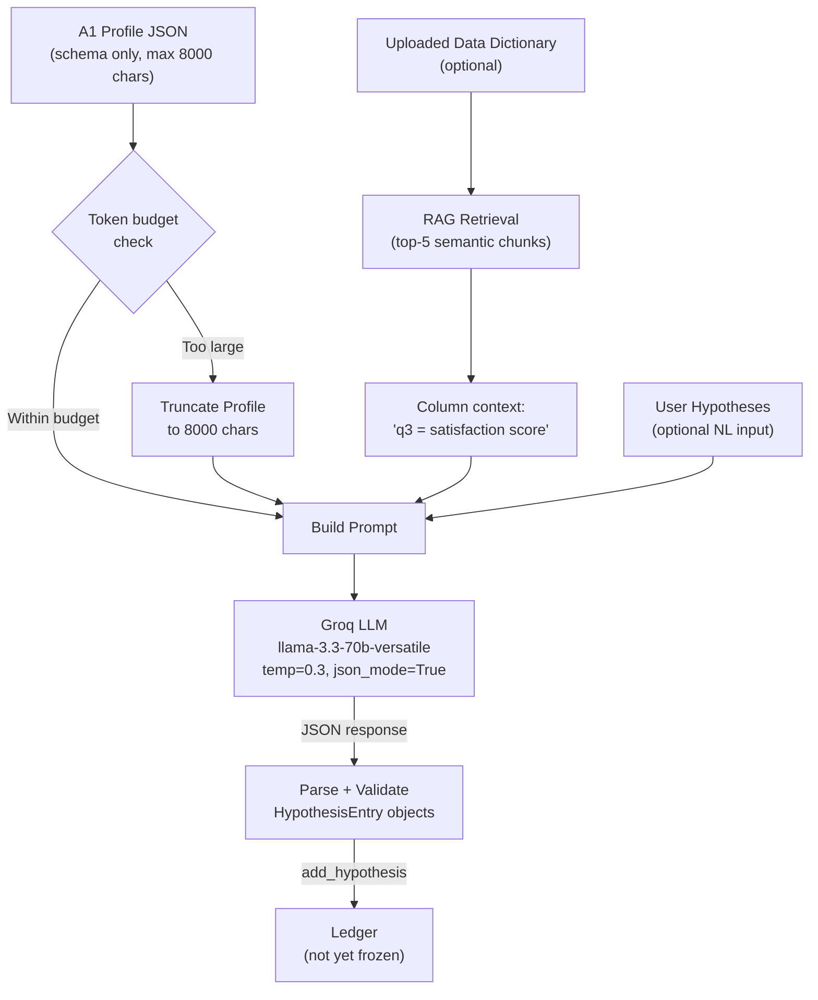
```mermaid
flowchart TD
    Profile["A1 Profile JSON\n(schema only, max 8000 chars)"] --> TokenCheck
    TokenCheck{"Token budget\ncheck"}
    TokenCheck -->|Within budget| Combine
    TokenCheck -->|Too large| Truncate["Truncate Profile\nto 8000 chars"]
    Truncate --> Combine

    DataDict["Uploaded Data Dictionary\n(optional)"] --> RAG
    RAG["RAG Retrieval\n(top-5 semantic chunks)"] --> RAGContext["Column context:\n'q3 = satisfaction score'"]
    RAGContext --> Combine

    UserH["User Hypotheses\n(optional NL input)"] --> Combine

    Combine["Build Prompt"] --> LLM["Groq LLM\nllama-3.3-70b-versatile\ntemp=0.3, json_mode=True"]

    LLM -->|JSON response| Parse["Parse + Validate\nHypothesisEntry objects"]
    Parse -->|add_hypothesis| Ledger["Ledger\n(not yet frozen)"]
```

**System Prompt (v1):**

```
You are a rigorous statistical hypothesis proposer.
Rules:
1. Every hypothesis must be testable with standard statistical tests
2. Do NOT propose causal hypotheses — only associative ones
3. Do NOT propose hypotheses about ID columns (>95% unique)
4. Do NOT propose hypotheses about columns with >30% missing values
5. Propose between 5-12 hypotheses
6. Return ONLY valid JSON
```

**Output format:**
```json
{
  "hypotheses": [
    {
      "id": "H01",
      "statement": "Mean monthly_charges differs significantly between churned and retained customers",
      "columns_involved": ["monthly_charges", "churn"],
      "test_type_hint": "Welch t-test or Mann-Whitney U"
    }
  ]
}
```

---

### A3 — Registrar (The Freeze)

**Nature:** 100% deterministic. The most critical agent in the system.  
**File:** [`backend/agents/a3_registrar.py`](./backend/agents/a3_registrar.py)

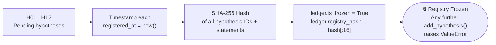
```mermaid
flowchart LR
    Hyp["H01...H12\nPending hypotheses"] --> Stamp["Timestamp each\nregistered_at = now()"]
    Stamp --> Hash["SHA-256 Hash\nof all hypothesis IDs + statements"]
    Hash --> Freeze["ledger.is_frozen = True\nledger.registry_hash = hash[:16]"]
    Freeze --> OUT(["🔒 Registry Frozen\nAny further add_hypothesis()\nraises ValueError"])
```

**The freeze hash:**
```python
payload = json.dumps(
    [h.id + h.statement for h in self.hypotheses],
    sort_keys=True
)
self.registry_hash = hashlib.sha256(payload.encode()).hexdigest()[:16]
```

If you run the same CSV twice and A2 proposes different hypotheses (LLM non-determinism), the hash will differ. This is surfaced as a `reproducibility_warning` in the ledger.

---

### A4 — Executor (ReAct Loop)

**Nature:** LLM + ReAct (Reason + Act) loop with sandboxed execution  
**File:** [`backend/agents/a4_executor.py`](./backend/agents/a4_executor.py)

This is the most complex agent. It implements a full ReAct loop for each hypothesis:

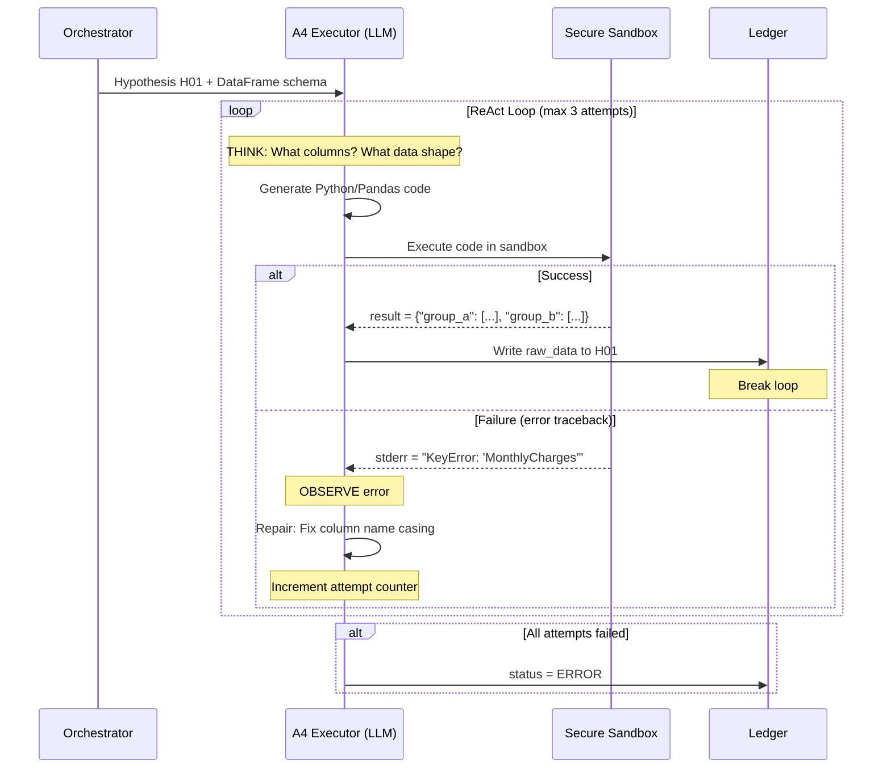
```mermaid
sequenceDiagram
    participant O as Orchestrator
    participant A4 as A4 Executor (LLM)
    participant SB as Secure Sandbox
    participant Ledger

    O->>A4: Hypothesis H01 + DataFrame schema
    
    loop ReAct Loop (max 3 attempts)
        Note over A4: THINK: What columns? What data shape?
        A4->>A4: Generate Python/Pandas code
        A4->>SB: Execute code in sandbox
        
        alt Success
            SB-->>A4: result = {"group_a": [...], "group_b": [...]}
            A4->>Ledger: Write raw_data to H01
            Note over Ledger: Break loop
        else Failure (error traceback)
            SB-->>A4: stderr = "KeyError: 'MonthlyCharges'"
            Note over A4: OBSERVE error
            A4->>A4: Repair: Fix column name casing
            Note over A4: Increment attempt counter
        end
    end
    
    alt All attempts failed
        A4->>Ledger: status = ERROR
    end
```

**ReAct Prompt Chain:**

```
Attempt 1 — Fresh generation:
SYSTEM: [A4_SYSTEM with chain-of-thought instructions]
USER:   Hypothesis: {statement}
        Schema: {column types + sample values}
        Write Pandas code, store result in `result` dict.

Attempt 2,3 — Repair mode:
SYSTEM: [A4_REPAIR_SYSTEM — focused on error fixing]
USER:   Previous code: {code_that_failed}
        Error: {full_traceback}
        Fix ONLY what is broken.
```

**Sandbox security checks:**
```python
_FORBIDDEN_KEYWORDS = [
    "import os", "import sys", "import subprocess",
    "open(", "exec(", "__import__", "os.system",
    "socket.connect", "urllib", "requests.get",
]
```

**Expected output from A4 (for a two-group comparison):**
```python
result = {
    "group_a": [45.2, 67.3, 89.1, ...],  # churned customers' charges
    "group_b": [23.4, 34.5, 56.7, ...],  # retained customers' charges
}
```

---

### A5 — Statistician (Fully Deterministic)

**Nature:** 100% deterministic. `scipy` + `statsmodels`. No LLM.  
**File:** [`backend/agents/a5_statistician.py`](./backend/agents/a5_statistician.py)

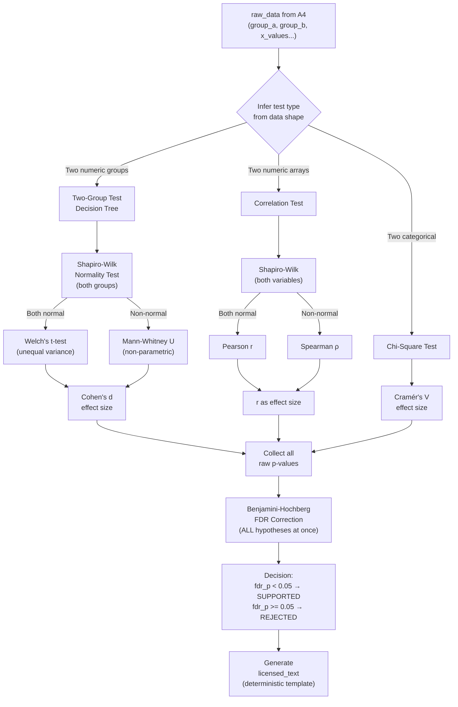
```mermaid
flowchart TD
    Raw["raw_data from A4\n(group_a, group_b, x_values...)"] --> Infer

    Infer{"Infer test type\nfrom data shape"}

    Infer -->|Two numeric groups| TwoGroup["Two-Group Test\nDecision Tree"]
    Infer -->|Two numeric arrays| Correlation["Correlation Test"]
    Infer -->|Two categorical| ChiSq["Chi-Square Test"]

    TwoGroup --> NormCheck["Shapiro-Wilk\nNormality Test\n(both groups)"]
    NormCheck -->|Both normal| Welch["Welch's t-test\n(unequal variance)"]
    NormCheck -->|Non-normal| MWU["Mann-Whitney U\n(non-parametric)"]

    Correlation --> NormCheckC["Shapiro-Wilk\n(both variables)"]
    NormCheckC -->|Both normal| Pearson["Pearson r"]
    NormCheckC -->|Non-normal| Spearman["Spearman ρ"]

    Welch & MWU --> EffectD["Cohen's d\neffect size"]
    Pearson & Spearman --> EffectR["r as effect size"]
    ChiSq --> EffectV["Cramér's V\neffect size"]

    EffectD & EffectR & EffectV --> Collect["Collect all\nraw p-values"]
    Collect --> FDR["Benjamini-Hochberg\nFDR Correction\n(ALL hypotheses at once)"]
    FDR --> Decide["Decision:\nfdr_p < 0.05 → SUPPORTED\nfdr_p >= 0.05 → REJECTED"]
    Decide --> License["Generate\nlicensed_text\n(deterministic template)"]
```

**Benjamini-Hochberg FDR** is applied across ALL hypotheses simultaneously — not per-hypothesis. This is the critical statistical control:

```python
_, fdr_p_values, _, _ = multipletests(
    raw_p_values,   # [0.03, 0.001, 0.04, 0.8, 0.02, ...]
    alpha=0.05,
    method="fdr_bh"
)
```

**Effect size labels:**
| Cohen's d | Label |
|-----------|-------|
| ≥ 0.8 | `large` |
| ≥ 0.5 | `medium` |
| ≥ 0.2 | `small` |
| < 0.2 | `negligible` |

---

### A6 — Reporter (Grounded LLM)

**Nature:** LLM constrained by `licensed_text` contract  
**File:** [`backend/agents/a6_reporter.py`](./backend/agents/a6_reporter.py)

A6 receives **only** the `licensed_text` fields from A5's output — never raw p-values, never raw data, never the original hypotheses list.

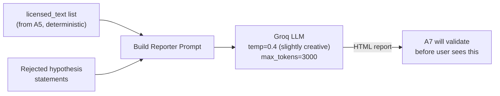
```mermaid
flowchart LR
    LT["licensed_text list\n(from A5, deterministic)"] --> Prompt
    Rejected["Rejected hypothesis\nstatements"] --> Prompt
    Prompt["Build Reporter Prompt"] --> LLM["Groq LLM\ntemp=0.4 (slightly creative)\nmax_tokens=3000"]
    LLM -->|HTML report| Validate["A7 will validate\nbefore user sees this"]
```

**Reporter System Prompt constraint:**
```
ABSOLUTE RULES:
1. You may ONLY report findings in the LICENSED TEXTS below.
2. NEVER use: "causes", "leads to", "results in", "affects", "drives"
3. USE ONLY: "is associated with", "correlates with", "differs between"
4. Always report effect sizes alongside p-values.
5. Rejected hypotheses MUST be acknowledged as "no significant association found".
```

---

### A7 — Adversary (Red Team)

**Nature:** LLM adversary in bounded game with A6  
**File:** [`backend/agents/a7_adversary.py`](./backend/agents/a7_adversary.py)

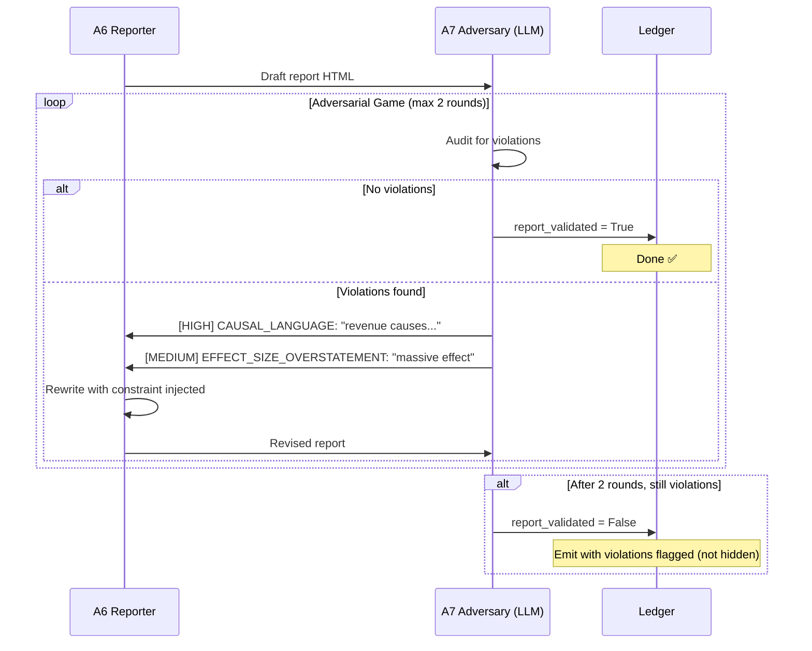
```mermaid
sequenceDiagram
    participant A6 as A6 Reporter
    participant A7 as A7 Adversary (LLM)
    participant Ledger

    A6->>A7: Draft report HTML
    
    loop Adversarial Game (max 2 rounds)
        A7->>A7: Audit for violations
        
        alt No violations
            A7->>Ledger: report_validated = True
            Note over Ledger: Done ✅
        else Violations found
            A7->>A6: [HIGH] CAUSAL_LANGUAGE: "revenue causes..."
            A7->>A6: [MEDIUM] EFFECT_SIZE_OVERSTATEMENT: "massive effect"
            A6->>A6: Rewrite with constraint injected
            A6->>A7: Revised report
        end
    end
    
    alt After 2 rounds, still violations
        A7->>Ledger: report_validated = False
        Note over Ledger: Emit with violations flagged (not hidden)
    end
```

**Violation types detected:**

| Type | Example | Severity |
|------|---------|---------|
| `CAUSAL_LANGUAGE` | "higher charges *cause* churn" | HIGH |
| `EFFECT_SIZE_OVERSTATEMENT` | "massive effect" for d=0.3 | MEDIUM |
| `PHANTOM_FINDING` | Mentions relationship not in ledger | HIGH |
| `OVERGENERALIZATION` | "All customers behave this way" | MEDIUM |

---

### A8 — Meta-Agent (Self-Improving Loop)

**Nature:** LLM + telemetry database analysis  
**File:** [`backend/agents/a8_meta_agent.py`](./backend/agents/a8_meta_agent.py)

This is the standout engineering feature. The system improves itself over time.

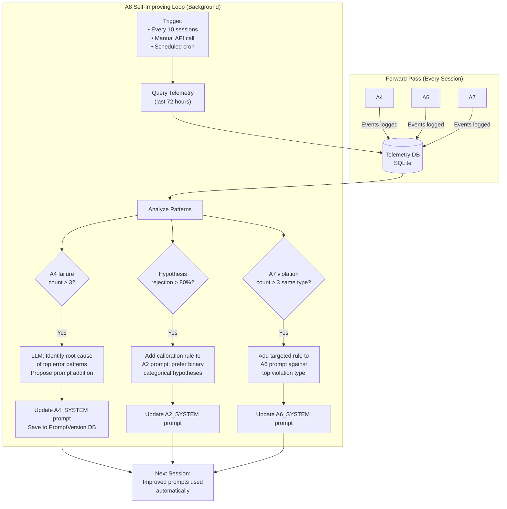
```mermaid
flowchart TD
    subgraph "Forward Pass (Every Session)"
        A4 & A6 & A7 -->|Events logged| TelDB[(Telemetry DB\nSQLite)]
    end

    subgraph "A8 Self-Improving Loop (Background)"
        Trigger["Trigger:\n• Every 10 sessions\n• Manual API call\n• Scheduled cron"] --> Query
        Query["Query Telemetry\n(last 72 hours)"] --> TelDB
        TelDB --> Analyze["Analyze Patterns"]

        Analyze --> P1{"A4 failure\ncount ≥ 3?"}
        P1 -->|Yes| Fix4["LLM: Identify root cause\nof top error patterns\nPropose prompt addition"]
        Fix4 --> Patch4["Update A4_SYSTEM prompt\nSave to PromptVersion DB"]

        Analyze --> P2{"Hypothesis\nrejection > 80%?"}
        P2 -->|Yes| Fix2["Add calibration rule to\nA2 prompt: prefer binary\ncategorical hypotheses"]
        Fix2 --> Patch2["Update A2_SYSTEM prompt"]

        Analyze --> P3{"A7 violation\ncount ≥ 3 same type?"}
        P3 -->|Yes| Fix6["Add targeted rule to\nA6 prompt against\ntop violation type"]
        Fix6 --> Patch6["Update A6_SYSTEM prompt"]
    end

    Patch4 & Patch2 & Patch6 --> NextSession["Next Session:\nImproved prompts used\nautomatically"]
```

**Example of A8 prompt evolution:**

*Before A8 runs:*
```
A4_SYSTEM: "...Write clean Pandas code to extract data..."
```

*After A8 detects 15 failures involving datetime columns:*
```
A4_SYSTEM: "...Write clean Pandas code to extract data...

# [A8 Auto-Improvement v1]
Always use `pd.to_datetime(df[col], errors='coerce')` for temporal columns.
Never assume datetime columns are already parsed — always coerce explicitly."
```

---

### A9 — NL → SQL + Mermaid Flowchart

**Nature:** LLM with structured JSON output + live SQLite execution  
**File:** [`backend/agents/a9_sql_converter.py`](./backend/agents/a9_sql_converter.py)

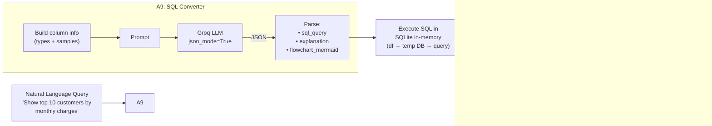
```mermaid
flowchart LR
    NL["Natural Language Query\n'Show top 10 customers by\nmonthly charges'"] --> A9

    subgraph "A9: SQL Converter"
        ColInfo["Build column info\n(types + samples)"] --> Prompt
        Prompt --> LLM["Groq LLM\njson_mode=True"]
        LLM -->|JSON| Parse["Parse:\n• sql_query\n• explanation\n• flowchart_mermaid"]
    end

    Parse --> SQLite["Execute SQL in\nSQLite in-memory\n(df → temp DB → query)"]
    SQLite -->|Results| Response["API Response:\n• SQL query\n• Mermaid diagram\n• Query results (max 100 rows)"]

    Response --> Frontend["Frontend renders:\n• Syntax-highlighted SQL\n• Interactive Mermaid diagram\n• Results table"]
```

**Example output for "Show monthly revenue by segment":**

```sql
SELECT segment, 
       COUNT(*) as customer_count,
       ROUND(AVG(monthly_charges), 2) as avg_monthly_revenue,
       ROUND(SUM(monthly_charges), 2) as total_monthly_revenue
FROM data_table
WHERE segment IS NOT NULL
GROUP BY segment
ORDER BY total_monthly_revenue DESC
```

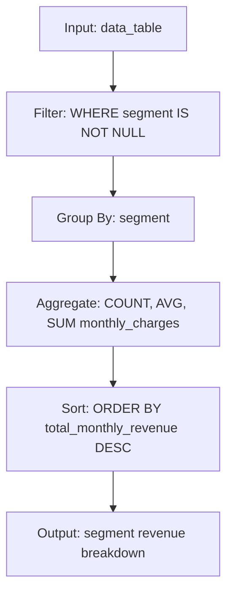
```mermaid
graph TD
    A[Input: data_table] --> B[Filter: WHERE segment IS NOT NULL]
    B --> C[Group By: segment]
    C --> D[Aggregate: COUNT, AVG, SUM monthly_charges]
    D --> E[Sort: ORDER BY total_monthly_revenue DESC]
    E --> F[Output: segment revenue breakdown]
```

---

### A10 — Visual Analyst

**Nature:** Fully deterministic Plotly  
**File:** [`backend/agents/a10_visual_analyst.py`](./backend/agents/a10_visual_analyst.py)

Runs in parallel with the main pipeline immediately after A0, generating a full data scientist dashboard:

| Chart Type | Logic |
|-----------|-------|
| **Data Quality Overview** | Missing value % per column, colored green→red |
| **Numeric Distributions** | Histogram + Box plot side-by-side for all numeric cols |
| **Categorical Bar Charts** | Top-15 value counts for all low-cardinality categorical cols |
| **Pearson Correlation Heatmap** | Diverging red-white-blue, annotated with r values |
| **Time Series** | Auto-detected datetime columns × numeric columns |

All charts use the **Design System palette** (Royal Blue, Emerald, Crimson) for brand consistency.

---

## 5. Tool Calling & Function Chains

Ledger uses **implicit tool calling** — agents call Python functions directly (not OpenAI-style function calling). Each agent's "tools" are:

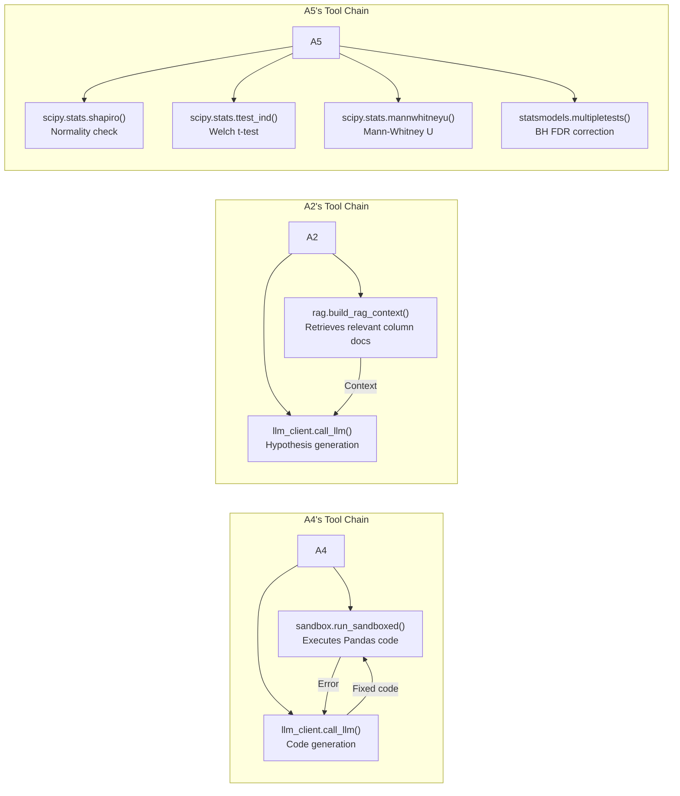
```mermaid
flowchart LR
    subgraph "A4's Tool Chain"
        A4 --> T1["sandbox.run_sandboxed()\nExecutes Pandas code"]
        A4 --> T2["llm_client.call_llm()\nCode generation"]
        T1 -->|Error| T2
        T2 -->|Fixed code| T1
    end

    subgraph "A2's Tool Chain"
        A2 --> T3["rag.build_rag_context()\nRetrieves relevant column docs"]
        A2 --> T4["llm_client.call_llm()\nHypothesis generation"]
        T3 -->|Context| T4
    end

    subgraph "A5's Tool Chain"
        A5 --> T5["scipy.stats.shapiro()\nNormality check"]
        A5 --> T6["scipy.stats.ttest_ind()\nWelch t-test"]
        A5 --> T7["scipy.stats.mannwhitneyu()\nMann-Whitney U"]
        A5 --> T8["statsmodels.multipletests()\nBH FDR correction"]
    end
```

**The `call_llm()` function signature (unified tool for all LLM agents):**
```python
def call_llm(
    system_prompt: str,
    user_prompt: str,
    model: str = "groq",          # groq → gemini fallback
    temperature: float = 0.2,
    max_tokens: int = 4096,
    json_mode: bool = False,
    retries: int = 3,             # Exponential backoff
) -> Tuple[str, int]:             # (response_text, tokens_used)
```

---

## 6. RAG Architecture

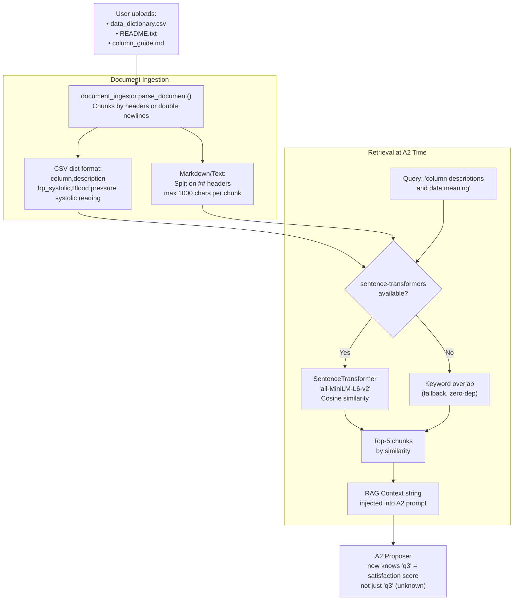
```mermaid
flowchart TD
    Upload["User uploads:\n• data_dictionary.csv\n• README.txt\n• column_guide.md"] --> Parse

    subgraph "Document Ingestion"
        Parse["document_ingestor.parse_document()\nChunks by headers or double newlines"]
        CSV["CSV dict format:\ncolumn,description\nbp_systolic,Blood pressure systolic reading"]
        MD["Markdown/Text:\nSplit on ## headers\nmax 1000 chars per chunk"]
        Parse --> CSV & MD
    end

    subgraph "Retrieval at A2 Time"
        Query["Query: 'column descriptions\nand data meaning'"]
        Try{"sentence-transformers\navailable?"}

        Try -->|Yes| Semantic["SentenceTransformer\n'all-MiniLM-L6-v2'\nCosine similarity"]
        Try -->|No| TF["Keyword overlap\n(fallback, zero-dep)"]

        Semantic & TF --> TopK["Top-5 chunks\nby similarity"]
        TopK --> Context["RAG Context string\ninjected into A2 prompt"]
    end

    CSV & MD --> Try
    Query --> Try
    Context --> A2["A2 Proposer\nnow knows 'q3' = satisfaction score\nnot just 'q3' (unknown)"]
```

**RAG context example injected into A2:**
```
RETRIEVED DATA DICTIONARY CONTEXT:
Column 'q3': Customer satisfaction score for response time (1-5 scale)
---
Column 'csat': Overall customer satisfaction (Likert scale, 1=Very Dissatisfied)
---
Column 'tenure': Months the customer has been with the company
```

---

## 7. Multi-Agent Orchestration

### SSE Streaming Protocol

The state machine yields **Server-Sent Events** that the React frontend consumes in real-time:

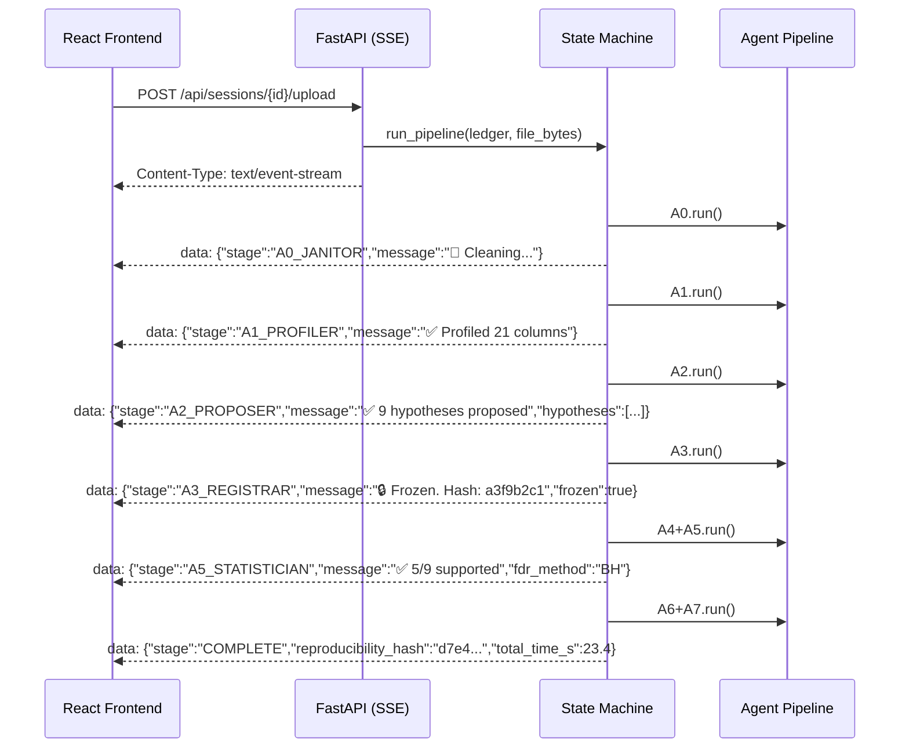
```mermaid
sequenceDiagram
    participant FE as React Frontend
    participant API as FastAPI (SSE)
    participant SM as State Machine
    participant Agents as Agent Pipeline

    FE->>API: POST /api/sessions/{id}/upload
    API->>SM: run_pipeline(ledger, file_bytes)
    API-->>FE: Content-Type: text/event-stream

    SM->>Agents: A0.run()
    SM-->>FE: data: {"stage":"A0_JANITOR","message":"🧹 Cleaning..."}

    SM->>Agents: A1.run()
    SM-->>FE: data: {"stage":"A1_PROFILER","message":"✅ Profiled 21 columns"}

    SM->>Agents: A2.run()
    SM-->>FE: data: {"stage":"A2_PROPOSER","message":"✅ 9 hypotheses proposed","hypotheses":[...]}

    SM->>Agents: A3.run()
    SM-->>FE: data: {"stage":"A3_REGISTRAR","message":"🔒 Frozen. Hash: a3f9b2c1","frozen":true}

    SM->>Agents: A4+A5.run()
    SM-->>FE: data: {"stage":"A5_STATISTICIAN","message":"✅ 5/9 supported","fdr_method":"BH"}

    SM->>Agents: A6+A7.run()
    SM-->>FE: data: {"stage":"COMPLETE","reproducibility_hash":"d7e4...","total_time_s":23.4}
```

### Session Management

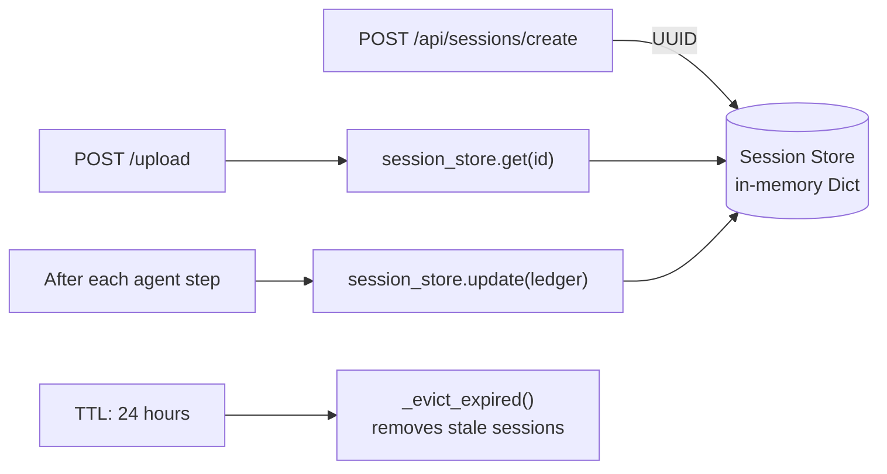
```mermaid
flowchart LR
    Create["POST /api/sessions/create"] -->|UUID| Store[(Session Store\nin-memory Dict)]
    Upload["POST /upload"] --> Get["session_store.get(id)"]
    Get --> Store
    Each["After each agent step"] --> Update["session_store.update(ledger)"]
    Update --> Store
    TTL["TTL: 24 hours"] --> Evict["_evict_expired()\nremoves stale sessions"]
```

---

## 8. Self-Improving Loop (Detailed)

### Telemetry Schema

Every agent event is logged to SQLite:

```sql
-- agent_events: one row per agent invocation
CREATE TABLE agent_events (
    id INTEGER PRIMARY KEY,
    session_id TEXT,
    agent_name TEXT,        -- "A4_EXECUTOR_H03"
    timestamp DATETIME,
    success BOOLEAN,
    duration_ms REAL,
    tokens_used INTEGER,
    input_summary TEXT,
    output_summary TEXT,
    error_message TEXT
);

-- hypothesis_events: one row per hypothesis adjudication  
CREATE TABLE hypothesis_events (
    id INTEGER PRIMARY KEY,
    session_id TEXT,
    hypothesis_id TEXT,
    statement TEXT,
    test_selected TEXT,
    raw_p_value REAL,
    fdr_p_value REAL,
    decision TEXT,          -- "SUPPORTED" | "REJECTED"
    repair_count INTEGER    -- How many A4 self-repairs were needed
);

-- prompt_versions: A8 writes here when it improves a prompt
CREATE TABLE prompt_versions (
    id INTEGER PRIMARY KEY,
    agent_name TEXT,
    version INTEGER,
    template TEXT,
    rationale TEXT,         -- Why A8 made this change
    created_at DATETIME,
    is_active BOOLEAN
);
```

### Improvement Cycle

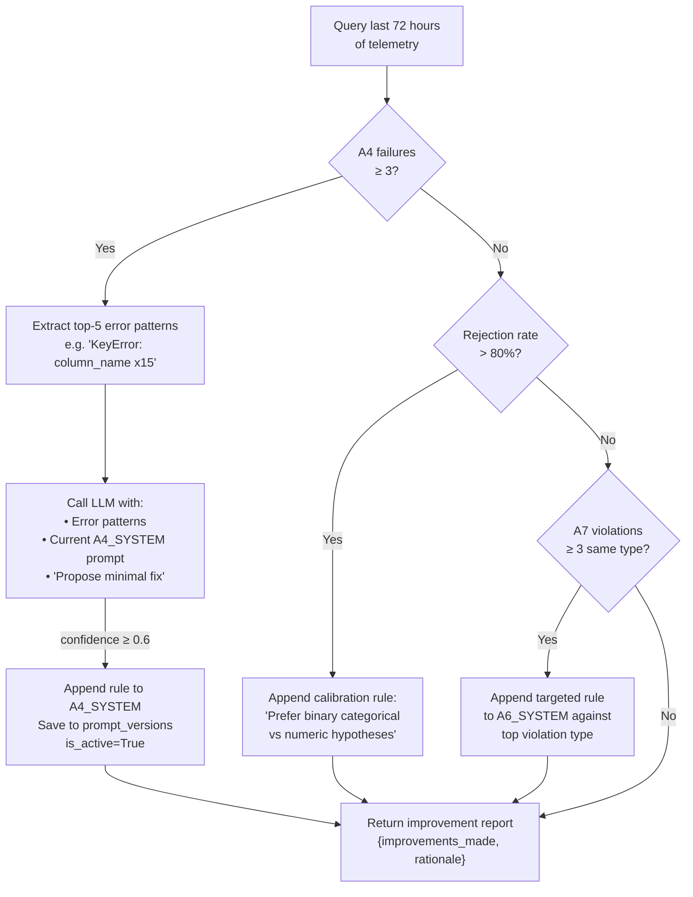
```mermaid
flowchart TD
    T72["Query last 72 hours\nof telemetry"] --> A4F

    A4F{"A4 failures\n≥ 3?"}
    A4F -->|Yes| A4Q["Extract top-5 error patterns\ne.g. 'KeyError: column_name x15'"]
    A4Q --> A4LLM["Call LLM with:\n• Error patterns\n• Current A4_SYSTEM prompt\n• 'Propose minimal fix'"]
    A4LLM -->|confidence ≥ 0.6| A4P["Append rule to A4_SYSTEM\nSave to prompt_versions\nis_active=True"]

    A4F -->|No| A2F

    A2F{"Rejection rate\n> 80%?"}
    A2F -->|Yes| A2P["Append calibration rule:\n'Prefer binary categorical\nvs numeric hypotheses'"]
    A2F -->|No| A7F

    A7F{"A7 violations\n≥ 3 same type?"}
    A7F -->|Yes| A7P["Append targeted rule\nto A6_SYSTEM against\ntop violation type"]
    A7F -->|No| Done

    A4P & A2P & A7P --> Done["Return improvement report\n{improvements_made, rationale}"]
```

---

## 9. Observability & Telemetry Pipeline

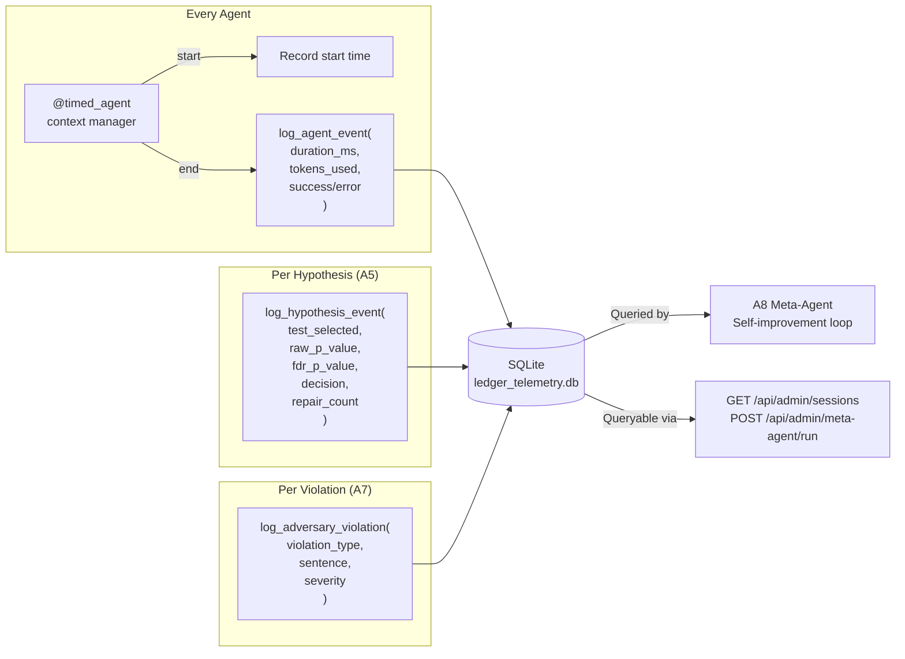
```mermaid
flowchart LR
    subgraph "Every Agent"
        CM["@timed_agent\ncontext manager"]
        CM -->|start| Timer["Record start time"]
        CM -->|end| Log["log_agent_event(\n  duration_ms,\n  tokens_used,\n  success/error\n)"]
    end

    Log --> DB[(SQLite\nledger_telemetry.db)]

    subgraph "Per Hypothesis (A5)"
        A5E["log_hypothesis_event(\n  test_selected,\n  raw_p_value,\n  fdr_p_value,\n  decision,\n  repair_count\n)"]
    end
    A5E --> DB

    subgraph "Per Violation (A7)"
        A7E["log_adversary_violation(\n  violation_type,\n  sentence,\n  severity\n)"]
    end
    A7E --> DB

    DB -->|Queried by| A8["A8 Meta-Agent\nSelf-improvement loop"]
    DB -->|Queryable via| Admin["GET /api/admin/sessions\nPOST /api/admin/meta-agent/run"]
```

**Context manager usage (every agent):**
```python
with timed_agent(ledger.session_id, "A5_STATISTICIAN") as ctx:
    # ... agent work ...
    ctx["output"] = "FDR corrected. Supported: 5/9"
    ctx["tokens"] = 0  # Deterministic agent, no tokens
# Auto-logs on exit: duration_ms, success/failure, output
```

---

## 10. Security & Sandbox

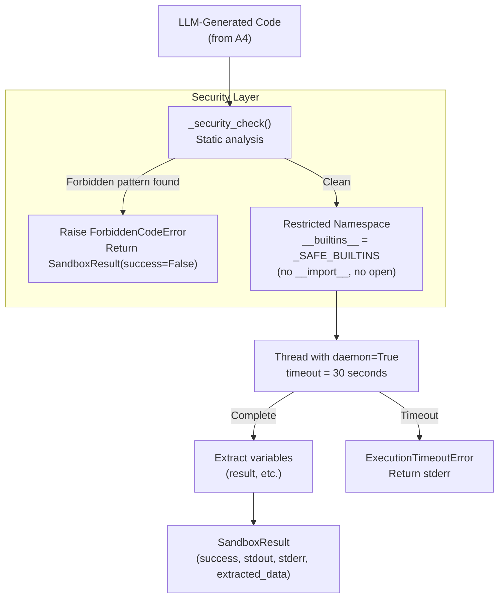
```mermaid
flowchart TD
    Code["LLM-Generated Code\n(from A4)"] --> SC

    subgraph "Security Layer"
        SC["_security_check()\nStatic analysis"]
        SC -->|Forbidden pattern found| REJECT["Raise ForbiddenCodeError\nReturn SandboxResult(success=False)"]
        SC -->|Clean| NS["Restricted Namespace\n__builtins__ = _SAFE_BUILTINS\n(no __import__, no open)"]
    end

    NS --> Thread["Thread with daemon=True\ntimeout = 30 seconds"]
    Thread -->|Complete| Extract["Extract variables\n(result, etc.)"]
    Thread -->|Timeout| TO["ExecutionTimeoutError\nReturn stderr"]
    Extract --> Return["SandboxResult\n(success, stdout, stderr, extracted_data)"]
```

**What is blocked:**
```python
_FORBIDDEN_KEYWORDS = [
    "import os",      # Filesystem access
    "import sys",     # System manipulation  
    "import subprocess",  # Shell execution
    "import socket",  # Network access
    "open(",          # File I/O
    "exec(",          # Nested execution
    "__import__",     # Dynamic imports
    "os.system",      # Shell commands
    "urllib",         # HTTP requests
    "requests.get",   # HTTP requests
]
```

**What is pre-injected (safe):**
```python
exec_globals = {
    "__builtins__": _SAFE_BUILTINS,  # Curated safe subset of Python builtins
    "pd": pandas,
    "np": numpy,
    "df": cleaned_dataframe,
}
```

---

## 11. Evaluation Framework

Ledger is evaluated against 4 benchmark suites to demonstrate statistical rigor:

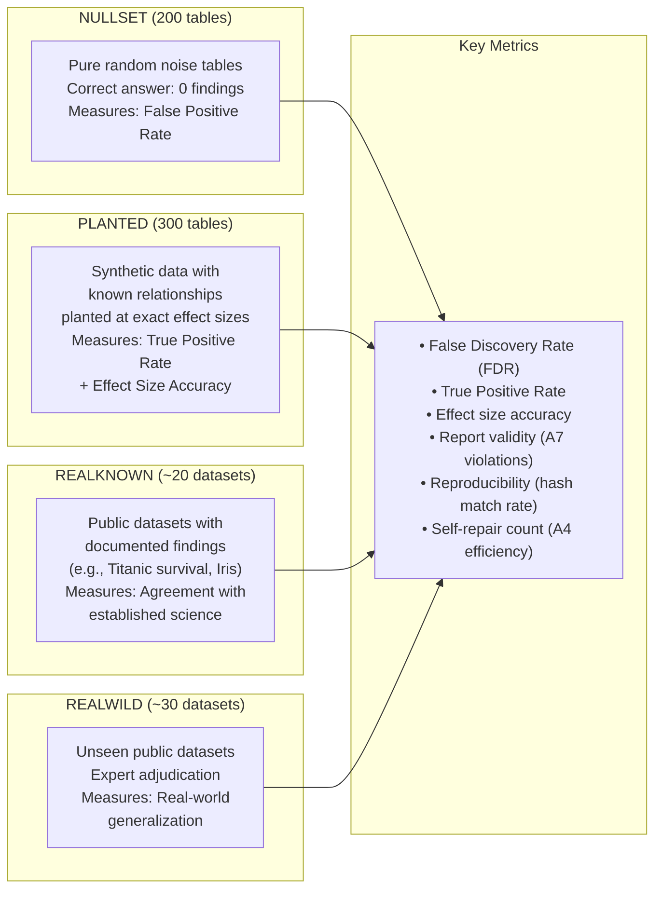
```mermaid
flowchart LR
    subgraph "NULLSET (200 tables)"
        NS["Pure random noise tables\nCorrect answer: 0 findings\nMeasures: False Positive Rate"]
    end

    subgraph "PLANTED (300 tables)"
        PL["Synthetic data with\nknown relationships\nplanted at exact effect sizes\nMeasures: True Positive Rate\n+ Effect Size Accuracy"]
    end

    subgraph "REALKNOWN (~20 datasets)"
        RK["Public datasets with\ndocumented findings\n(e.g., Titanic survival, Iris)\nMeasures: Agreement with\nestablished science"]
    end

    subgraph "REALWILD (~30 datasets)"
        RW["Unseen public datasets\nExpert adjudication\nMeasures: Real-world\ngeneralization"]
    end

    NS & PL & RK & RW --> Metrics

    subgraph "Key Metrics"
        Metrics["• False Discovery Rate (FDR)\n• True Positive Rate\n• Effect size accuracy\n• Report validity (A7 violations)\n• Reproducibility (hash match rate)\n• Self-repair count (A4 efficiency)"]
    end
```

**Baseline Comparisons:**

| System | FDR Control | Reproducible | Causal Guard | Self-Improving |
|--------|------------|-------------|--------------|----------------|
| **Ledger** | ✅ BH FDR | ✅ Hash | ✅ A7 Red Team | ✅ A8 Meta |
| PandasAI | ❌ None | ❌ | ❌ | ❌ |
| OpenInterpreter | ❌ None | ❌ | ❌ | ❌ |
| Single-prompt LLM | ❌ None | ❌ | ❌ | ❌ |
| ydata-profiling | N/A (no tests) | ✅ | N/A | ❌ |

---

## 12. Token Optimization Strategy

| Agent | Strategy | Why |
|-------|---------|-----|
| **A2 Proposer** | Profile truncated to 8,000 chars | Prevents context overflow on wide datasets |
| **A2 Proposer** | RAG top-5 chunks only | Adds context without bloating prompt |
| **A4 Executor** | Schema (not raw data) passed | 50-row sample → 30x token reduction |
| **A6 Reporter** | Only `licensed_text` passed | Prevents padding/hallucination |
| **A8 Meta-Agent** | Telemetry summary (not raw logs) | Aggregated patterns, not raw rows |
| **All LLM agents** | `temperature=0.1-0.3` | Low variance = fewer retries |
| **All LLM agents** | `json_mode=True` where applicable | Eliminates parsing overhead |

---

## 13. Deployment Architecture

```mermaid
flowchart TD
    User["👤 User\n(Browser)"] --> Vercel

    subgraph "Vercel (Frontend)"
        Vercel["React + Vite\nStatic build\nCDN-cached"]
    end

    Vercel -->|HTTPS API calls| Render

    subgraph "Render (Backend)"
        Render["FastAPI + Uvicorn\nPersistent server\n(not serverless!)"]
        SQLite["SQLite\n(telemetry DB)"]
        Sessions["In-memory\nSession Store"]
        Render --- SQLite & Sessions
    end

    Render -->|LLM calls| Groq["Groq API\nllama-3.3-70b-versatile\n(primary)"]
    Render -->|Fallback| Gemini["Gemini API\n(secondary)"]
```

> **Why Render (not Vercel) for the backend?**
> Vercel Serverless Functions have a 10-second timeout and 50MB memory limit.
> The A4 agent runs Pandas code that can take 10-30 seconds.
> Render's free tier provides persistent servers with no timeout restrictions.

---

*This document is maintained as a living reference. Submit a PR to add evaluation results, new agent implementations, or deployment guides.*
